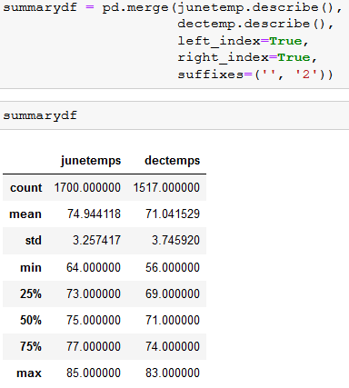
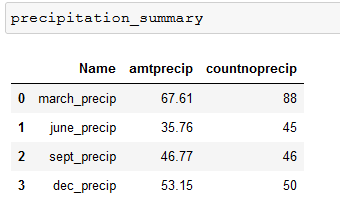

# Surfs Up
## The Purpose of this analysis is to compare the differences in temperatures by month retrieved from Weather stations near Oahu.

### The following conclusions can be made from the image below, which is a statistics summary of the dataset filtered for June and December.
* There are slightly (~10%) fewer observed temps for Dec than June
* Dec lows are 8° colder, Dec Highs are 2° colder
* Dec temps have a range of 27°, June temps have a range of 21°

Additionally, we can see the average temp is 74(June) and 71(Dec) respectively, and the standard deviation being between 3.2 and 3.7.

### This information can lead to the conclusion the weather is very nice year-round, at least in terms of temperature.




### I further developed the analysis by adding two additional queries,
1. Provide Accumulation of Precipitation
2. Provide Addition of March and September

this information shows when it rains, it rains a lot (The month with a lot of precipitation, march, is also the month with the most NO-RAIN days).



shown below is the code to develop this information:
```
#Extra queries
# 1. Provide Accumulation of Precipitation
# 2. Provide Addition of March and September
# NOTE: a filter for just the Station 'USC00519281' was added since this is in coursework.
# *. Additionally, I included no of occurrences of NO rain

marchrain = session.query(Measurement.date, Measurement.prcp).filter(extract('month', Measurement.date)==3).filter(Measurement.station == 'USC00519281')
junerain = session.query(Measurement.date, Measurement.prcp).filter(extract('month', Measurement.date)==6).filter(Measurement.station == 'USC00519281')
septrain = session.query(Measurement.date, Measurement.prcp).filter(extract('month', Measurement.date)==9).filter(Measurement.station == 'USC00519281')
decrain = session.query(Measurement.date, Measurement.prcp).filter(extract('month', Measurement.date)==12).filter(Measurement.station == 'USC00519281')


marchraindf = pd.DataFrame(marchrain, columns=['date','march_precip'])
marchraindf.set_index('date', drop=True, inplace=True)

juneraindf = pd.DataFrame(junerain, columns=['date','june_precip'])
juneraindf.set_index('date', drop=True, inplace=True)

septraindf = pd.DataFrame(septrain, columns=['date','sept_precip'])
septraindf.set_index('date', drop=True, inplace=True)

decraindf = pd.DataFrame(decrain, columns=['date','dec_precip'])
decraindf.set_index('date', drop=True, inplace=True)


tmp = { 
'Name' : ['march_precip', 'june_precip', 'sept_precip', 'dec_precip' ],
'amtprecip' : [marchraindf["march_precip"].sum(), juneraindf["june_precip"].sum(), 
                septraindf["sept_precip"].sum(), decraindf["dec_precip"].sum()],
'countnoprecip' : [int(marchraindf[marchraindf["march_precip"]==0].count()),
                    int(juneraindf[juneraindf["june_precip"]==0].count()), 
                    int(septraindf[septraindf["sept_precip"]==0].count()), 
                    int(decraindf[decraindf["dec_precip"]==0].count())]} 

precipitation_summary = pd.DataFrame(tmp, columns = ['Name', 'amtprecip', 'countnoprecip']) 
```
